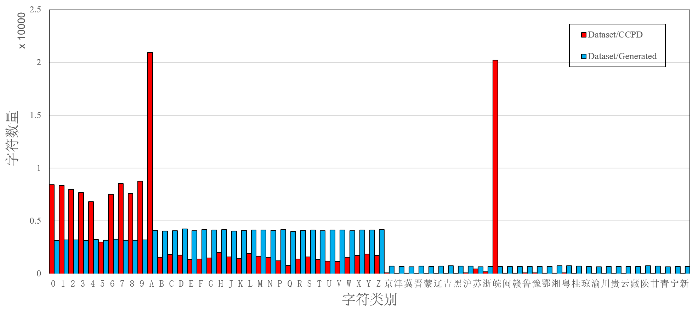
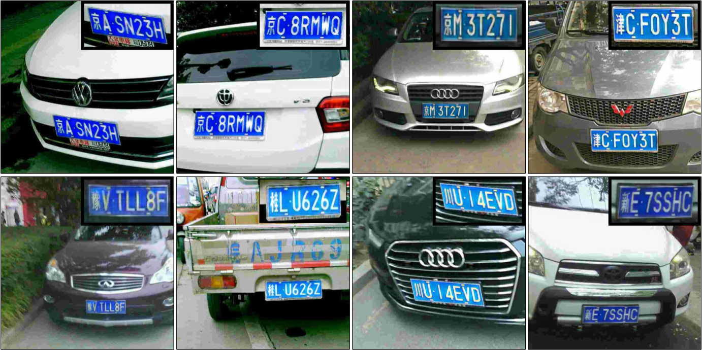
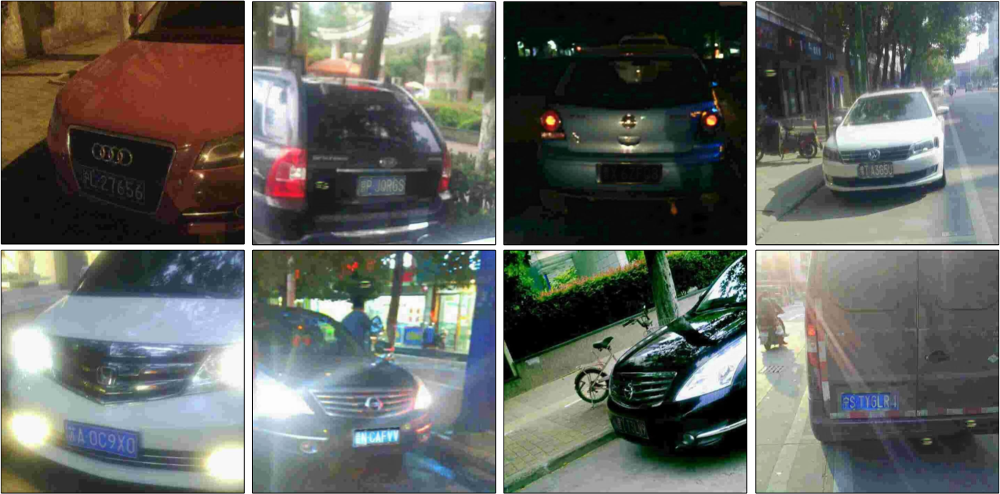
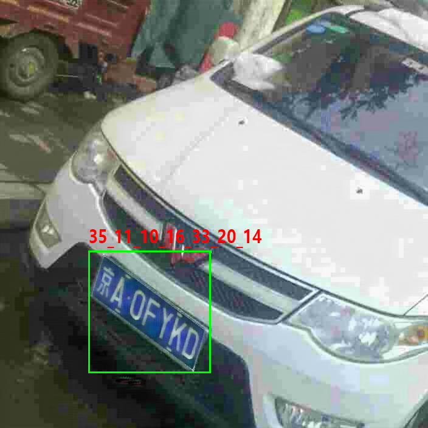

# DGUT_LPR Dataset
This is an expansion of the [CCPD](https://github.com/detectRecog/CCPD) Chinese license plate dataset.

Images are generated by CycleGAN, divided into 8 classes, improving the character annotation unbalance that exists in the original CCPD dataset.

## Baidu Drive
Download Link: 
- [Click here](https://pan.baidu.com/s/1SxQb8--H-U-KoSMmlCZA3w) 
- Download Code: ***dgdt***

## Character statistics

Red bar and blue bar in Figure 1 shows the character distribution of original <code>CCPD</code> dataset and our generated dataset.

Solved the problem of <code>UNBALANCED distribution of characters</code> in CCPD dataset.


<center>Fig.1 Character distribution of CCPD and our generated dataset</center>

## Numbers
| Class  | Base  | Blur | Rotate | Tilt | Fn   | Db   | Weather | Challenge |
| :----- | :---- | :--- | :----- | :--- | :--- | :--- | :------ | :-------- |
| Number | 10000 | 2000 | 2000   | 2000 | 2000 | 2000 | 1000    | 807       |


# Examples
First sample is the real image from CCPD, the rest are generated images

## Base:


## Blur & Rotate_Tilt & Fn & Db & Weather:


## Challenge:


## Annotation
```shell
File name:    35_11_10_16_33_20_14@149_417_339_612@170_417_339_542_318_612_149_487@1_fake.jpg
Annotations:  
|   plate-number    |     bbox      |  coordinates of corner points | *Future Support* class index of lp-type
```



## Character Map
character_map.txt
```
# 字符映射表
# 映射结果如：京A0FYKD -> 35_11_10_16_33_20_14
# "*"表示 blank 位
0 *
# 1. 数字字符(0-9)
1 1
2 2
3 3
4 4
5 5
6 6
7 7
8 8
9 9
10 0
# 2. 大写英文字母字符，其中不含有字母“O”和“I” (11-34)
11 A
12 B
13 C
14 D
15 E
16 F
17 G
18 H
19 J
20 K
21 L
22 M
23 N
24 P
25 Q
26 R
27 S
28 T
29 U
30 V
31 W
32 X
33 Y
34 Z
# 3. 中文字符
35 京
36 津
37 冀
38 晋
39 蒙
40 辽
41 吉
42 黑
43 沪
44 苏
45 浙
46 皖
47 闽
48 赣
49 鲁
50 豫
51 鄂
52 湘
53 粤
54 桂
55 琼
56 渝
57 川
58 贵
59 云
60 藏
61 陕
62 甘
63 青
64 宁
65 新
# 港澳等特殊牌照中文字符
# 66 港
# 67 澳
# 68 使
# 69 领
# 70 学
# 71 警
# 72 挂
```

*Future Support* class_map.txt
```
# 车牌类别映射
# 暂时不做细分
0 background
1 blue
2 green
3 black
4 white
5 yellow
```
